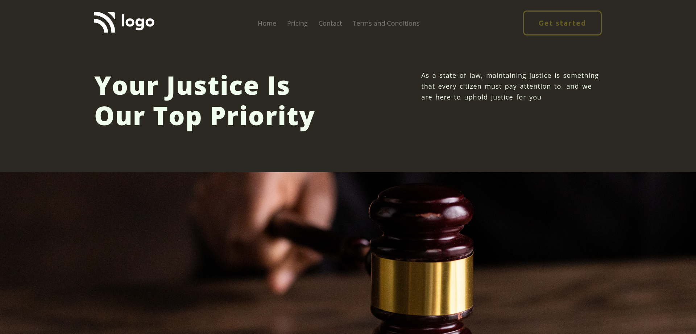

# Project - 3 Justice Our Top Priority

This the third mini-project among the 15 Ineuron-projects.

## Table of contents

- [Overview](#overview)
  - [Screenshot](#screenshot)
  - [Links](#links)
- [My process](#my-process)
  - [Built with](#built-with)
  - [What I learned](#continues-development)
  - [Useful resources](#useful-resources)
- [Author](#author)
- [Acknowledgments](#acknowledgments)

## Overview

### Screenshot



### Links

- Code File URL: [github.com](https://github.com/Jyotimoykathar/Project-03)
- Live Site URL: [netlify.app](https://project-03-justice.netlify.app/)

## My Process

### Built with

- Semantic HTML5 markup
- CSS custom properties
- Flexbox Css

### What I learned

This the css design code snippet of the hero container image, where i learned to placed the image within the parent div as required.

```css
.hero-image {
  object-fit: cover; /* Does not scale the image */
  object-position: 50% 35%; /*Center the image within the element*/
  height: 100%;
  width: 100%;
}
```

### Continued development

I have still a lot to practise on positioning.The website is static, responsive is reuired.

### Useful resources

- [MDN](https://developer.mozilla.org/en-US/) - This website helped me to any thing i had to look upon.
- [Position-css](https://developer.mozilla.org/en-US/docs/Web/CSS/position) - For more info on css image position.

## Author

- Github page- [Jyotimoykathar](https://github.com/Jyotimoykathar/)

## Acknowledgments

Special Thanks to [MDN](https://developer.mozilla.org/en-US/) website and [w3Schools](https://www.w3schools.com/css/css_positioning.asp and to all the Ineuron team for the mini-challenge to test and improve my positioning skills with image on css.
